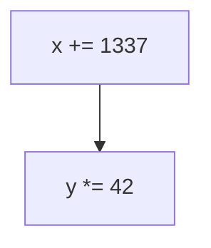
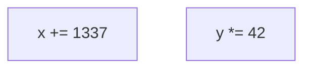
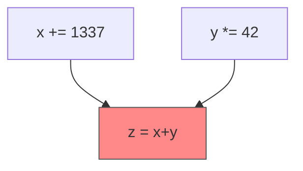
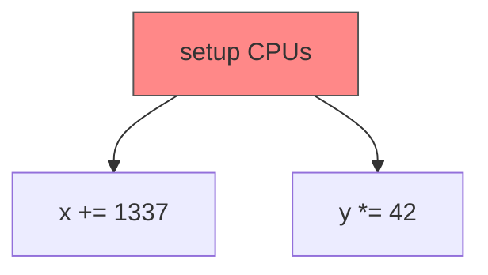
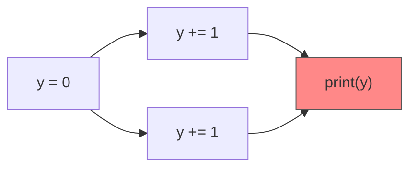

# difficulties of parallel execution

<div class="flex h-80 justify-around items-end">
<figure v-click>

<div class="w-80 flex justify-center">


</div>
<figcaption>sequential</figcaption>
</figure>


<figure v-click>


<figcaption>parallel</figcaption>
</figure>
</div>

<!--
### difficulties of parallel execution
- define **sequential**: executing code in order mostly only on one CPU
- define **parallel**: executing code out of order at the same time on multiple
CPUs
- **naive approach**: 2 CPUs == doubled computing power/performance
- **not true** because of:
- **orchestration**: every computing task (e.g. calculating a prime number) needs some
setup which needs to be executed sequentially (e.g. telling the other CPUs
what to do)
- **synchronization**: maybe computing task needs to combine result of multiple
CPUs
-->

---
hideInToc: true
---

# difficulties of parallel execution


<div class="flex h-80 justify-around items-end">
<figure class="invisible">

<div class="w-80 flex justify-center">


</div>
<figcaption>sequential</figcaption>
</figure>


<figure>


<figcaption>parallel</figcaption>
</figure>
</div>

<div class="fixed bottom-[185px] right-[360px] italic">thread</div>

<!--
### difficulties of parallel execution
- define **sequential**: executing code in order mostly only on one CPU
- define **parallel**: executing code out of order at the same time on multiple
CPUs
- **naive approach**: 2 CPUs == doubled computing power/performance
- **not true** because of:
- **orchestration**: every computing task (e.g. calculating a prime number) needs some
setup which needs to be executed sequentially (e.g. telling the other CPUs
what to do)
- **synchronization**: maybe computing task needs to combine result of multiple
CPUs
-->

---
hideInToc: true
---

# difficulties of parallel execution

<div class="flex h-80 justify-around items-end">

<figure v-click>
<div class="w-80 flex justify-center">


</div>
<figcaption>synchronization</figcaption>
</figure>

<figure>


<figcaption>orchestration</figcaption>
</figure>
</div>

<!--
### difficulties of parallel execution
- define **sequential**: executing code in order mostly only on one CPU
- define **parallel**: executing code out of order at the same time on multiple
CPUs
- **naive approach**: 2 CPUs == doubled computing power/performance
- **not true** because of:
- **orchestration**: every computing task (e.g. calculating a prime number) needs some
setup which needs to be executed sequentially (e.g. telling the other CPUs
what to do)
- **synchronization**: maybe computing task needs to combine result of multiple
CPUs
-->

---
hideInToc: true
---

# difficulties of parallel execution

<div class="mt-20 flex flex-col items-center w-full">

<div class="text-3xl">

what does `print(y)` print?
</div>

<div class="mt-4">


</div>

</div>

<!--
### difficulties of parallel execution
- **data race**: maybe overwriting of modified value
- example in C++: exaggerated to reveal problem
-->

---
hideInToc: true
---

# difficulties of parallel execution

<div class="flex justify-start">

```cpp {all}
#include <chrono>
#include <cstdio>
#include <thread>
#include <vector>

int main() {
    std::vector<std::thread> threads;
    int y = 0;
    const int THREADS = 10000;

    for (int i = 0; i < THREADS; i++) {
        threads.push_back(std::thread([&y]() {
            std::this_thread::sleep_for(
                std::chrono::milliseconds(10)
            );
            y += 1;
        }));
    }

    for (int i = 0; i < THREADS; i++) { threads[i].join(); }

    printf("y = %d\n", y);
}
```

<div class="text-3xl mt-20 ml-20 font-mono">
<div v-click>
$ ./cpp-example<br>
y = 9994
</div>

<div v-click class="mt-4">
$ ./cpp-example<br>
y = 9992
</div>

<div v-click class="mt-4">
$ ./cpp-example<br>
y = 10000
</div>
</div>

</div>

<!--
### difficulties of parallel execution
- **data race**: maybe overwriting of modified value
- example in C++: exaggerated to reveal problem
-->
