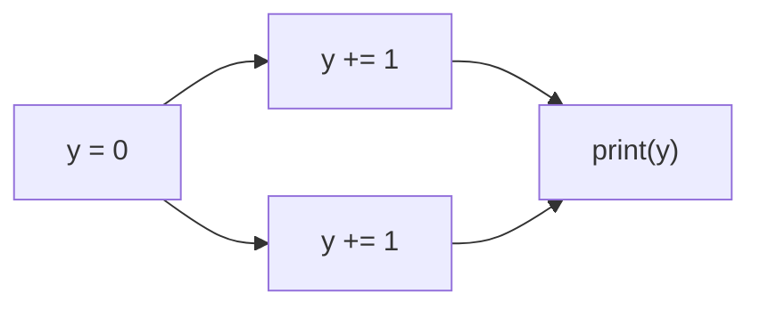
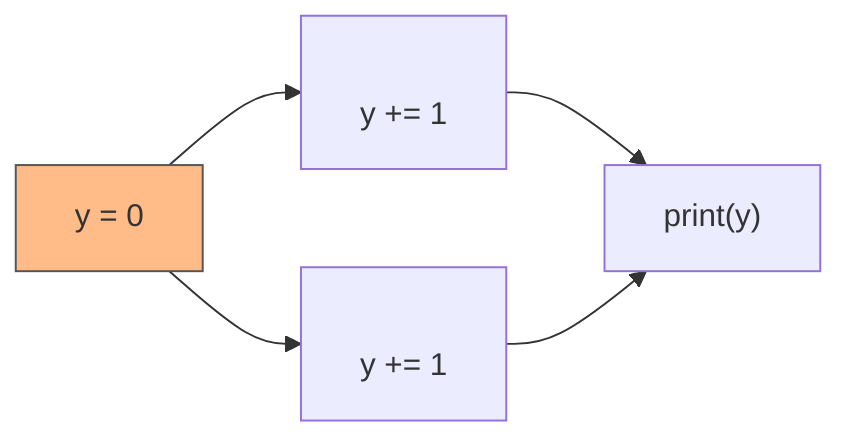
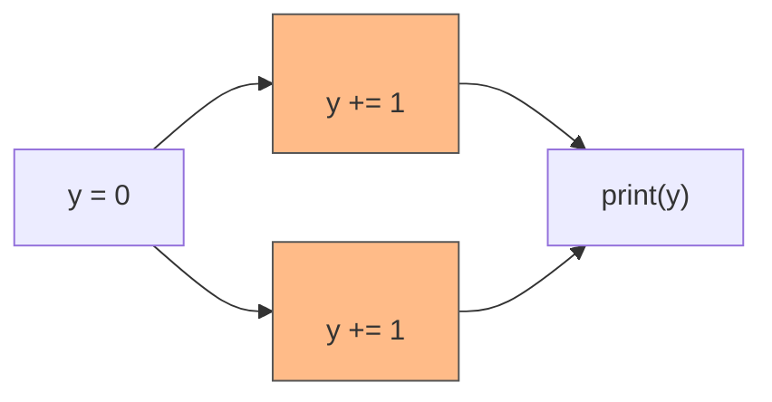
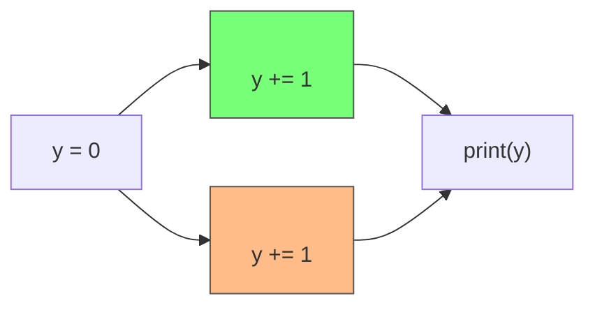
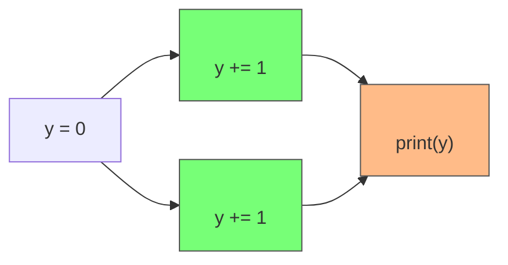

# parallelism in Rust

<div class="flex">

```rust {all|6-14,20}
use std::thread::{self, JoinHandle};
use std::time::Duration;

fn main() {
    let mut threads: Vec<JoinHandle<()>> = Vec::new();
    const THREADS: u64 = 10000;
    let mut y = 0;

    for _ in 0..THREADS {
        threads.push(thread::spawn(move || {
            thread::sleep(Duration::from_millis(10));
            y += 1;
        }));
    }

    for th in threads {
        let _ = th.join();
    }

    println!("y = {}", y);
}
```
<div class="text-3xl mt-20 ml-20 font-mono">
<div v-click>
$ ./rust-example<br>
y = 0
</div>
</div>

</div>

<!--
### parallelism in Rust
- naive approach does not work, because **variable y is copied**
- try to use a reference-counted pointer (keeps track how many references exist)
- not **mutable** anymore -> **compiler error**
- need to use a **Mutex**
- enables mutability and solves the data race
-->

---
hideInToc: true
---

# parallelism in Rust

<div class="flex">

```rust {all|8,11,14}
use std::sync::Arc;
use std::thread::{self, JoinHandle};
use std::time::Duration;

fn main() {
    let mut threads: Vec<JoinHandle<()>> = Vec::new();
    const THREADS: u64 = 10000;
    let y = Arc::new(0);

    for _ in 0..THREADS {
        let y = Arc::clone(&y);
        threads.push(thread::spawn(move || {
            thread::sleep(Duration::from_millis(10));
            *y += 1;
        }));
    }

    for th in threads {
        let _ = th.join();
    }

    println!("y = {}", y);
}
```
<div v-click class="text-sm mt-20 ml-10 font-mono">

</div>

</div>

<!--
### parallelism in Rust
- naive approach does not work, because **variable y is copied**
- try to use a reference-counted pointer (keeps track how many references exist)
- not **mutable** anymore -> **compiler error**
- need to use a **Mutex**
- enables mutability and solves the data race
-->

---
hideInToc: true
---

# parallelism in Rust

<div class="flex">

```rust {all|8,14,23}
use std::sync::{Arc, Mutex};
use std::thread::{self, JoinHandle};
use std::time::Duration;

fn main() {
    let mut threads: Vec<JoinHandle<()>> = Vec::new();
    const THREADS: u64 = 10000;
    let y = Arc::new(Mutex::new(0));

    for _ in 0..THREADS {
        let y = Arc::clone(&y);
        threads.push(thread::spawn(move || {
            thread::sleep(Duration::from_millis(10));
            let mut y = y.lock().unwrap();
            *y += 1;
        }));
    }

    for th in threads {
        let _ = th.join();
    }

    println!("y = {}", y.lock().unwrap());
}
```

<div class="text-3xl mt-20 ml-20 font-mono">
<div v-click>
$ ./rust-example<br>
y = 10000
</div>
</div>

</div>

<!--
### parallelism in Rust
- naive approach does not work, because **variable y is copied**
- try to use a reference-counted pointer (keeps track how many references exist)
- not **mutable** anymore -> **compiler error**
- need to use a **Mutex**
- enables mutability and solves the data race
-->

---
hideInToc: true
title: graph
---

# parallelism in Rust

<div class="mt-20 flex flex-col  items-center w-full">

<div class="mt-4">


</div>

</div>

<!--
- bring execution graph back
- variable y is guarded by a lock with only one key
- key to this lock must be acquired before a read or write to variable may occur
- step through execution
- bottom path must wait until it can acquire the key to the lock
-->

---
hideInToc: true
title: lock
---

# parallelism in Rust

<div class="mt-20 flex flex-col  items-center w-full">

<div class="mt-4">


</div>

<div class="mt-4 flex flex-row justify-between border-2 rounded border-gray-500 overflow-hidden w-55 h-15">
<div class="border-r-2 border-gray-500 h-full p-1 bg-green-400">
<div class="text-5xl i-tabler-lock-open" />
</div>


<div class="text-4xl mr-2">

`y = 0`
</div>
</div>

</div>

<!--
- bring execution graph back
- variable y is guarded by a lock with only one key
- key to this lock must be acquired before a read or write to variable may occur
- step through execution
- bottom path must wait until it can acquire the key to the lock
-->

---
hideInToc: true
title: key top thread
---

# parallelism in Rust

<div class="mt-20 flex flex-col  items-center w-full">

<div class="mt-4">


</div>

<div class="mt-4 flex flex-row justify-between border-2 rounded border-gray-500 overflow-hidden w-55 h-15">
<div class="border-r-2 border-gray-500 h-full p-1 bg-red-400">
<div class="text-5xl i-tabler-lock" />
</div>


<div class="text-4xl mr-2">

`y = 0`
</div>
</div>

</div>

<div class="text-3xl i-tabler-circle-key fixed top-[190px] left-[450px]" />
<div class="text-3xl i-tabler-player-pause-filled fixed top-[330px] left-[450px]" />

<!--
- bring execution graph back
- variable y is guarded by a lock with only one key
- key to this lock must be acquired before a read or write to variable may occur
- step through execution
- bottom path must wait until it can acquire the key to the lock
-->

---
hideInToc: true
title: unlock y
---

# parallelism in Rust

<div class="mt-20 flex flex-col  items-center w-full">

<div class="mt-4">


</div>

<div class="mt-4 flex flex-row justify-between border-2 rounded border-gray-500 overflow-hidden w-55 h-15">
<div class="border-r-2 border-gray-500 h-20 p-1 bg-green-400">
<div class="text-5xl i-tabler-lock-open" />
</div>


<div class="text-4xl mr-2">

`y = 0`
</div>
</div>

</div>

<div class="text-3xl i-tabler-player-pause-filled fixed top-[330px] left-[450px]" />

<!--
- bring execution graph back
- variable y is guarded by a lock with only one key
- key to this lock must be acquired before a read or write to variable may occur
- step through execution
- bottom path must wait until it can acquire the key to the lock
-->

---
hideInToc: true
title: key bottom thread
---

# parallelism in Rust

<div class="mt-20 flex flex-col  items-center w-full">

<div class="mt-4">


</div>

<div class="mt-4 flex flex-row justify-between border-2 rounded border-gray-500 overflow-hidden w-55 h-15">
<div class="border-r-2 border-gray-500 h-20 p-1 bg-red-400">
<div class="text-5xl i-tabler-lock" />
</div>


<div class="text-4xl mr-2">

`y = 0`
</div>
</div>

</div>

<div class="text-3xl i-tabler-circle-key fixed top-[330px] left-[450px]" />

<!--
- bring execution graph back
- variable y is guarded by a lock with only one key
- key to this lock must be acquired before a read or write to variable may occur
- step through execution
- bottom path must wait until it can acquire the key to the lock
-->

---
hideInToc: true
title: print(y)
---

# parallelism in Rust

<div class="mt-20 flex flex-col  items-center w-full">

<div class="mt-4">


</div>

<div class="mt-4 flex flex-row justify-between border-2 rounded border-gray-500 overflow-hidden w-55 h-15">
<div class="border-r-2 border-gray-500 h-20 p-1 bg-green-400">
<div class="text-5xl i-tabler-lock-open" />
</div>


<div class="text-4xl mr-2">

`y = 0`
</div>
</div>

</div>

<!--
- bring execution graph back
- variable y is guarded by a lock with only one key
- key to this lock must be acquired before a read or write to variable may occur
- step through execution
- bottom path must wait until it can acquire the key to the lock
-->

---
hideInToc: true
title: print(y)
---

# parallelism in Rust

<div class="mt-20 flex flex-col  items-center w-full">

<div class="mt-4">


</div>

<div class="mt-4 flex flex-row justify-between border-2 rounded border-gray-500 overflow-hidden w-55 h-15">
<div class="border-r-2 border-gray-500 h-20 p-1 bg-red-400">
<div class="text-5xl i-tabler-lock" />
</div>


<div class="text-4xl mr-2">

`y = 0`
</div>
</div>

</div>

<div class="text-3xl i-tabler-circle-key fixed top-[260px] left-[585px]" />

<!--
- bring execution graph back
- variable y is guarded by a lock with only one key
- key to this lock must be acquired before a read or write to variable may occur
- step through execution
- bottom path must wait until it can acquire the key to the lock
-->
